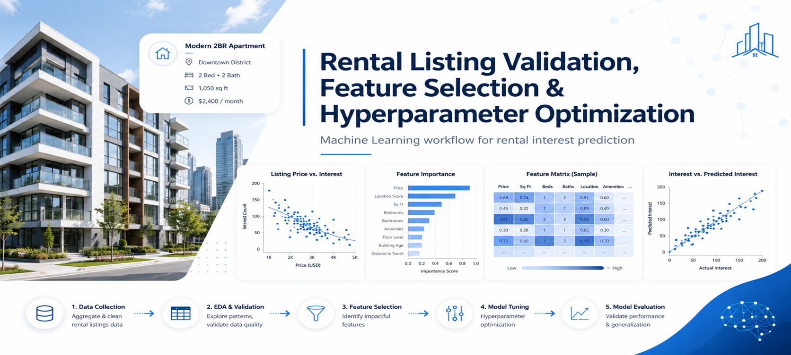
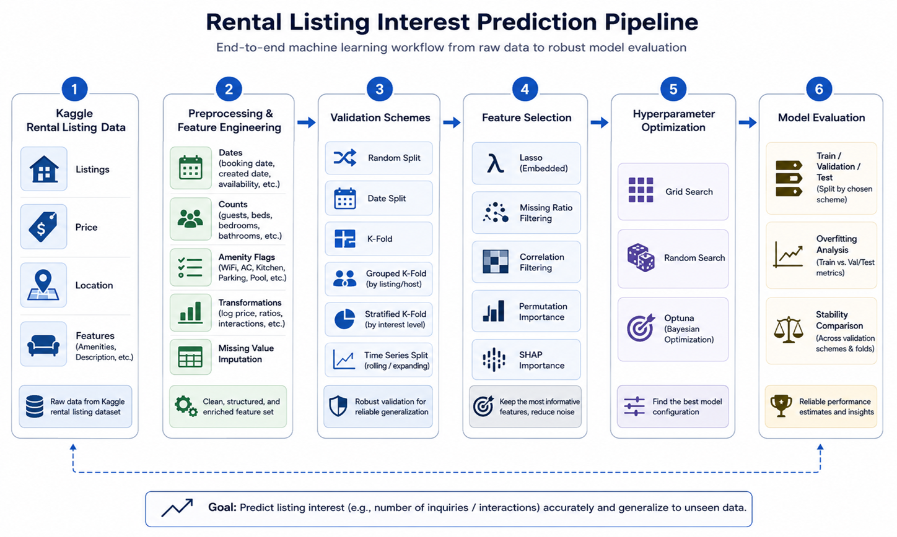

# Rental Listing Validation, Feature Selection and Hyperparameter Optimization

    



## Overview

This project is a machine learning workflow for rental listing interest prediction using the Kaggle **Two Sigma Connect: Rental Listing Inquiries** dataset.

The main goal is to study how validation strategies, feature selection methods, hyperparameter optimization, and regularization affect model quality and generalization.

Instead of focusing only on a final prediction score, this project emphasizes reliable model evaluation, overfitting detection, feature stability, and comparison of different machine learning experiment designs.

## Project Objective

The task is to predict the level of interest generated by rental apartment listings.

The target variable is:

```text
interest_level
```

Typical classes are:

```text
low
medium
high
```

The project uses listing attributes, price, location, creation date, description-derived features, photo counts, and extracted amenity indicators to build and evaluate machine learning models.

## Machine Learning Pipeline



The workflow includes:

```text
Data loading
Preprocessing
Feature engineering
Custom validation schemes
Cross-validation
Feature selection
Hyperparameter optimization
Model evaluation
Overfitting analysis
```

## Dataset

The dataset comes from the Kaggle competition:

```text
Two Sigma Connect: Rental Listing Inquiries
```

The original files include:

```text
train.json
test.json
sample_submission.csv
```

The full dataset is not included directly in this repository.

To run the notebook end-to-end, download the dataset from Kaggle and place the files in:

```text
data/train.json
data/test.json
data/sample_submission.csv
```

More details are available in:

```text
data/README.md
docs/dataset_description.md
```

## Feature Engineering

The project creates structured features from raw rental listing data.

Examples include:

```text
Number of photos
Number of features
Description length
Date-derived features
Price-related variables
Amenity indicators
```

The notebook also creates binary amenity features such as:

```text
Elevator
HardwoodFloors
CatsAllowed
DogsAllowed
Doorman
Dishwasher
NoFee
LaundryinBuilding
FitnessCenter
Pre-War
LaundryinUnit
RoofDeck
OutdoorSpace
DiningRoom
HighSpeedInternet
Balcony
SwimmingPool
NewConstruction
Terrace
```

These features convert semi-structured listing information into model-ready numerical variables.

## Validation Methods

The project implements custom validation methods and compares them with scikit-learn implementations.

Implemented validation schemes include:

```text
Random train-test split
Random train-validation-test split
Date-based train-test split
Date-based train-validation-test split
K-Fold cross-validation
Grouped K-Fold cross-validation
Stratified K-Fold cross-validation
Time Series Split
```

The goal is to understand how different validation strategies affect model evaluation and generalization.


## Feature Selection Methods

The notebook compares several feature selection strategies.

Implemented methods include:

```text
Lasso coefficient ranking
Missing-value ratio filtering
Correlation-based filtering
Permutation importance
SHAP-based interpretation
```

Each method is evaluated based on:

```text
Model quality
Speed
Stability
Interpretability
Practical usability
```

## Hyperparameter Optimization

The project compares multiple hyperparameter optimization methods for ElasticNet.

Implemented approaches include:

```text
Grid Search
Random Search
Optuna optimization
Optuna with cross-validation
```

The tuned ElasticNet hyperparameters are:

```text
alpha
l1_ratio
```

The comparison helps evaluate how different search strategies affect model performance, search efficiency, and stability.

## Model Evaluation

The workflow evaluates models on training, validation, and test samples.

The analysis focuses on:

```text
Training performance
Validation performance
Test performance
Train-validation gap
Overfitting detection
Feature subset stability
Cross-validation consistency
```


## Requirements

Main libraries used:

```text
numpy
pandas
scikit-learn
matplotlib
seaborn
optuna
shap
jupyter
```

## Documentation

Additional documentation is available in the `docs/` directory:

```text
docs/project_overview.md
docs/dataset_description.md
docs/validation_schemes.md
docs/feature_selection.md
```

The model summary is available in:

```text
reports/model_summary.md
```

## Skills Demonstrated

This project demonstrates skills in:

```text
Machine learning validation
Cross-validation implementation
Time-based splitting
Grouped validation
Stratified validation
Feature engineering
Feature selection
Regularization
Lasso
ElasticNet
Permutation importance
SHAP interpretation
Grid Search
Random Search
Optuna optimization
Overfitting analysis
Model evaluation
```


## Author

Luis Fernando Avalos Guzman

GitHub: [Luis99fer](https://github.com/Luis99fer)

## License

This project is licensed under the MIT License.